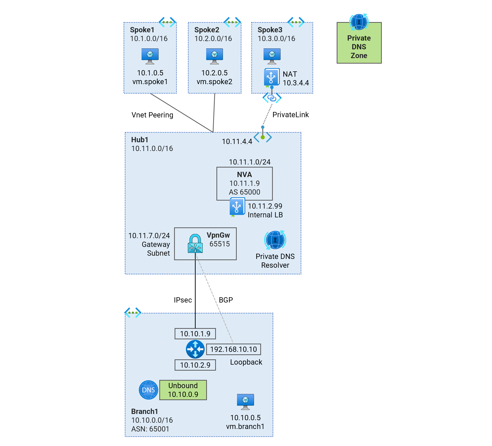
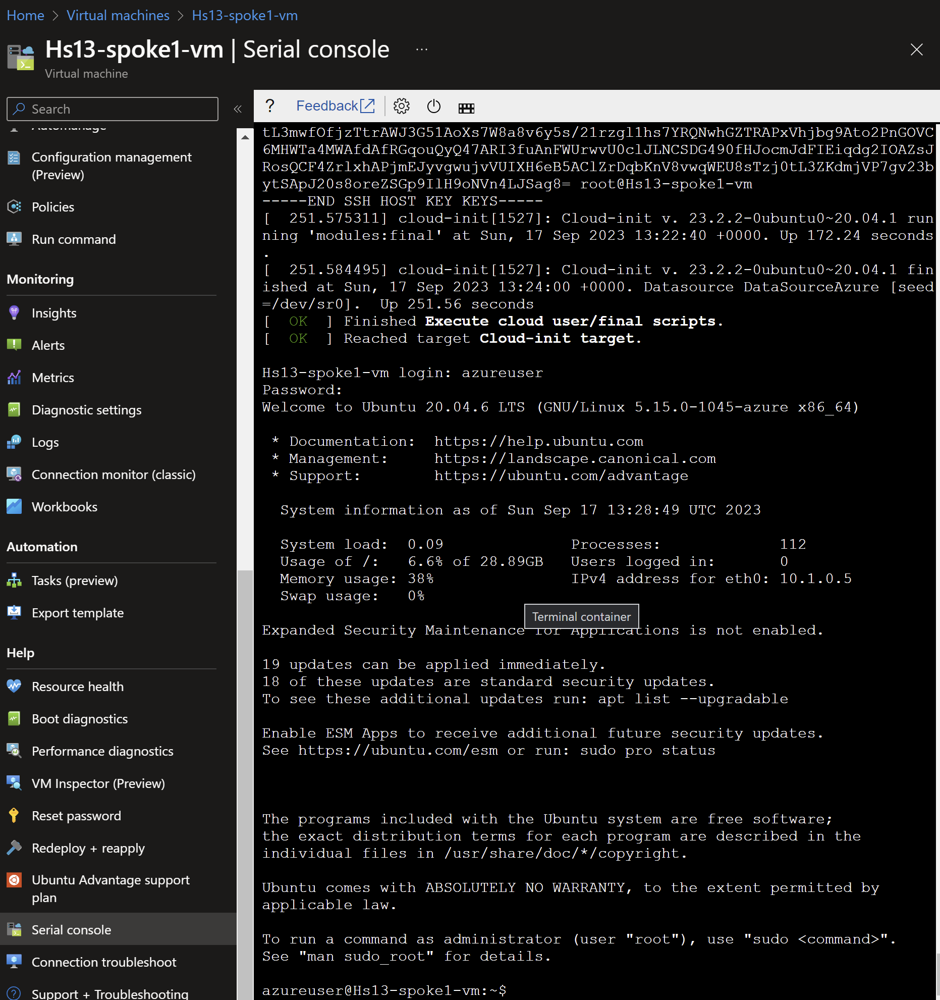

# Hub and Spoke - Dual Region <!-- omit from toc -->
## Lab: Hs13 <!-- omit from toc -->

Contents
- [Overview](#overview)
- [Prerequisites](#prerequisites)
- [Deploy the Lab](#deploy-the-lab)
- [Troubleshooting](#troubleshooting)
- [Testing](#testing)
  - [1. Ping IP](#1-ping-ip)
  - [2. Ping DNS](#2-ping-dns)
  - [3. Curl DNS](#3-curl-dns)
  - [4. Private Link Service](#4-private-link-service)
  - [5. Onprem Routes](#5-onprem-routes)
- [Cleanup](#cleanup)

## Overview

This terraform code deploys a multi-region standard Virtual Network (Vnet) hub and spoke topology playground with dynamic routing.



`Hub1` has an Azure Route Server (ARS) with BGP session to a Network Virtual Appliance (NVA) using a Cisco-CSR-100V router. The direct spokes `Spoke1` and `Spoke2` have Vnet peering to `Hub1`. An isolated `Spoke3` does not have Vnet peering to the `Hub1``, but is reachable from the hub via Private Link Service.

`Branch1` is the on-premises networks which is simulated using Vnet. A Multi-NIC Cisco-CSR-1000V NVA appliance connects to the Vnet hub using IPsec VPN connections with dynamic (BGP) routing.


## Prerequisites

Ensure you meet all requirements in the [prerequisites](../../prerequisites/) before proceeding.

## Deploy the Lab

1. Clone the Git Repository for the Labs
```sh
git clone https://github.com/kaysalawu/azure-network-terraform.git
```

2. Navigate to the lab directory
```sh
cd azure-network-terraform/1-hub-and-spoke/3-hub-spoke-nva-single-region
```

3. Run the following terraform commands and type **yes** at the prompt:
```sh
terraform init
terraform plan
terraform apply
```

## Troubleshooting

See the [troubleshooting](../../troubleshooting/) section for tips on how to resolve common issues that may occur during the deployment of the lab.

## Testing

Each virtual machine is pre-configured with a shell [script](../../scripts/server.sh) to run various types of tests. Serial console access has been configured for all virtual mchines. You can [access the serial console](https://learn.microsoft.com/en-us/troubleshoot/azure/virtual-machines/serial-console-overview#access-serial-console-for-virtual-machines-via-azure-portal) of a virtual machine from the Azure portal.

Login to virtual machine `Hs13-spoke1-vm` via the serial console.
- username = **azureuser**
- password = **Password123**



Run the following tests from inside the serial console.

### 1. Ping IP

This script pings the IP addresses of some test virtual machines and reports reachability and round trip time.

Run the IP ping test
```sh
ping-ip
```
Sample output
```sh

```

### 2. Ping DNS

This script pings the DNS name of some test virtual machines and reports reachability and round trip time.

Run the DNS ping test
```sh
ping-dns
```

Sample output
```sh

```

### 3. Curl DNS

This script uses curl to check reachability of web server (python Flask) on the test virtual machines. It reports HTTP response message, round trip time and IP address.

Run the DNS curl test
```sh
curl-dns
```

Sample output
```sh

```
We can see that spoke3 `vm.spoke3.az.corp` returns a **000** HTTP response code. This is expected as there is no Vnet peering to `Spoke3` from `Hub1`. But `Spoke3` web application is reachable via Private Link Service private endpoint `pep.hub1.az.corp`. The same explanation applies to `Spoke6` virtual machine `vm.spoke6.az.corp`

### 4. Private Link Service

Test access to `Spoke3` application using the private endpoint in `Hub1`.
```sh
curl pep.hub1.az.corp
```

Sample output
```sh

```

The `hostname` and `local-ip` fields belong to the servers running the web application - in this case `Spoke3` virtual machine. The `remote-ip` field (as seen by the web servers) is an IP addresses in the Private Link Service NAT subnet.

Repeat steps 1-4 for all other virtual machines.

### 5. Onprem Routes

Let's login to the onprem router `Hs13-branch1-nva` and observe its dynamic routes.

1. Login to virtual machine `Hs13-branch1-nva` via the serial console.
2. Enter username and password
   - username = **azureuser**
   - password = **Password123**
3. Enter the Cisco enable mode
```sh
enable
```
4. Display the routing table
```sh
show ip route
```

Sample output
```sh

```

5. Display BGP information
```sh
show ip bgp
```

Sample output
```sh

```

## Cleanup

1. Make sure you are in the lab directory
```sh
cd azure-network-terraform/1-hub-and-spoke/3-hub-spoke-nva-single-region
```

2. Delete the resource group to remove all resources installed.\
Run the following Azure CLI command:

```sh
az group delete -g Hs13RG --no-wait
```
