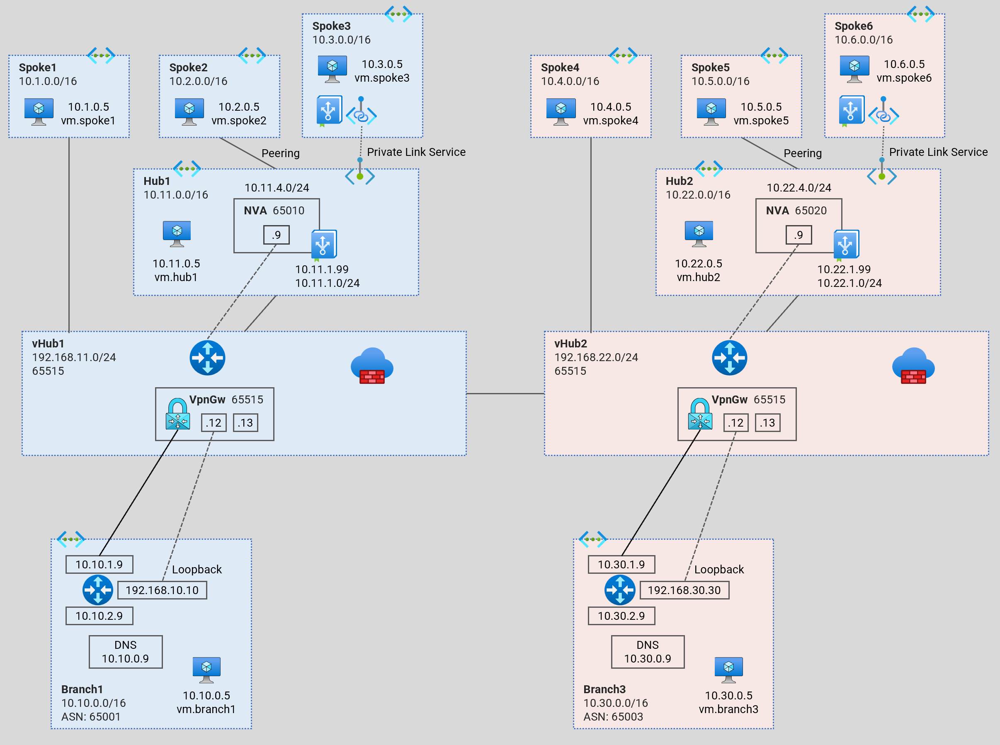
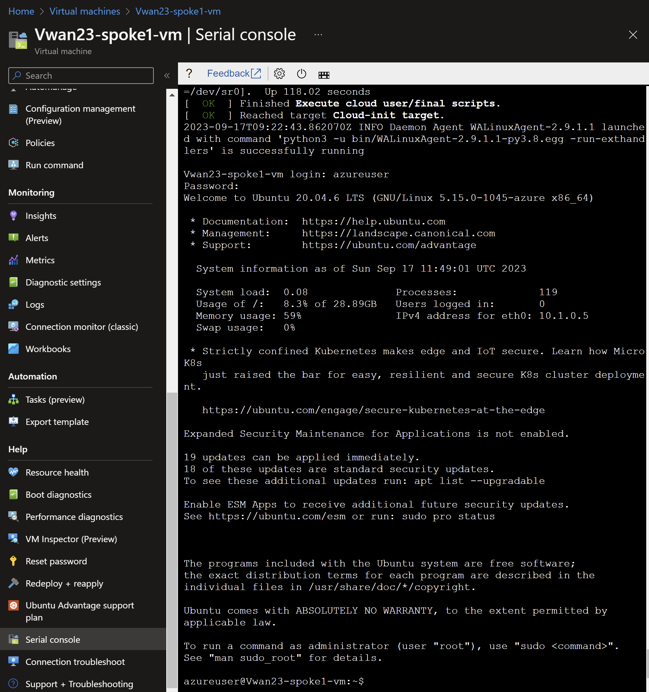

# Secure Virtual WAN - Dual Hub <!-- omit from toc -->
## Lab: Vwan23 <!-- omit from toc -->

Contents
- [Overview](#overview)
- [Prerequisites](#prerequisites)
- [Deploy the Lab](#deploy-the-lab)
- [Troubleshooting](#troubleshooting)
- [Testing](#testing)
  - [1. Ping IP](#1-ping-ip)
  - [2. Ping DNS](#2-ping-dns)
  - [3. Curl DNS](#3-curl-dns)
  - [4. Private Link Service](#4-private-link-service)
  - [5. Virtual WAN Routes](#5-virtual-wan-routes)
  - [6. Onprem Routes](#6-onprem-routes)
- [Cleanup](#cleanup)

## Overview

This terraform code deploys a single-region Secured Virtual WAN (Vwan) testbed to observe traffic routing patterns.



Standard Virtual Network (Vnet) hub (`Hub1`) connects to the Vwan hub (`vHub1`) via a Vwan connection. Direct spoke (`Spoke1`) is connected to the Vwan hub (`vHub1`). `Spoke2`is an indirect spoke from a Vwan perspective; and is connected via standard Vnet peering to `Hub1`. `Spoke2` uses the Network Virtual Applinace (NVA) in the standard Vnet hub (`Hub1`) as the next hop for traffic to all destinations.

The isolated spoke (`Spoke3`) does not have Vnet peering to the Vnet hub (`Hub1`), but is reachable via Private Link Service through a private endpoint in the hub.

`Branch1` is an on-premises network which is simulated using Vnet. Multi-NIC Cisco-CSR-1000V NVA appliances connect to the Vwan hubs using IPsec VPN connections with dynamic (BGP) routing.

## Prerequisites

Ensure you meet all requirements in the [prerequisites](../../prerequisites/) before proceeding.

## Deploy the Lab

1. Clone the Git Repository for the Labs
```sh
git clone https://github.com/kaysalawu/azure-network-terraform.git
```

2. Navigate to the lab directory
```sh
cd azure-network-terraform/2-virtual-wan/3-vwan-sec-single-region
```

3. Run the following terraform commands and type **yes** at the prompt:
```sh
terraform init
terraform plan
terraform apply
```

## Troubleshooting

See the [troubleshooting](../../troubleshooting/) section for tips on how to resolve common issues that may occur during the deployment of the lab.

## Testing

Each virtual machine is pre-configured with a shell [script](../../scripts/server.sh) to run various types of tests. Serial console access has been configured for all virtual mchines. You can [access the serial console](https://learn.microsoft.com/en-us/troubleshoot/azure/virtual-machines/serial-console-overview#access-serial-console-for-virtual-machines-via-azure-portal) of a virtual machine from the Azure portal.

Login to virtual machine `Vwan23-spoke1-vm` via the serial console.
- username = **azureuser**
- password = **Password123**



Run the following tests from inside the serial console.

### 1. Ping IP

This script pings the IP addresses of some test virtual machines and reports reachability and round trip time.

Run the IP ping test
```sh
ping-ip
```

Sample output
```sh

```

### 2. Ping DNS

This script pings the DNS name of some test virtual machines and reports reachability and round trip time.

Run the DNS ping test
```sh
ping-dns
```

Sample output
```sh

```

### 3. Curl DNS

This script uses curl to check reachability of web server (python Flask) on the test virtual machines. It reports HTTP response message, round trip time and IP address.

Run the DNS curl test
```sh
curl-dns
```

Sample output
```sh

```
We can see that spoke3 `vm.spoke3.az.corp` returns a **000** HTTP response code. This is expected as there is no Vnet peering to `Spoke3` from `Hub1`. But `Spoke3` web application is reachable via Private Link Service private endpoint `pep.hub1.az.corp`.

### 4. Private Link Service

Test access to `Spoke3` application using the private endpoint in `Hub1`.
```sh
curl pep.hub1.az.corp
```

Sample output
```sh

```
Test access to `Spoke6` application using the private endpoint in `Hub2`.
```sh
curl pep.hub2.az.corp
```

Sample output
```sh

```

The `hostname` and `local-ip` fields belong to the servers running the web application - in this case `Spoke3` and `Spoke6`virtual machines. The `remote-ip` fields (as seen by the web servers) are the respective IP addresses in the Private Link Service NAT subnets.

Repeat steps 1-4 for all other virtual machines.

### 5. Virtual WAN Routes

1. Ensure you are in the lab directory `azure-network-terraform/2-virtual-wan/3-vwan-sec-single-region`
2. Display the virtual WAN routing table(s)

```sh
bash ../../scripts/_routes.sh Vwan23RG
```

Sample output
```sh

```

### 6. Onprem Routes

Let's login to the onprem router `Vwan23-branch1-nva` and observe its dynamic routes.

1. Login to virtual machine `Vwan23-branch1-nva` via the serial console.
2. Enter username and password
   - username = **azureuser**
   - password = **Password123**
3. Enter the Cisco enable mode
```sh
enable
```
4. Display the routing table
```sh
show ip route
```

Sample output
```sh

```

5. Display BGP information
```sh
show ip bgp
```

Sample output
```sh

```

## Cleanup

1. Navigate to the lab directory
```sh
cd azure-network-terraform/2-virtual-wan/3-vwan-sec-single-region
```

2. Delete the resource group to remove all resources installed.\
Run the following Azure CLI command:

```sh
az group delete -g Vwan23RG --no-wait
```
