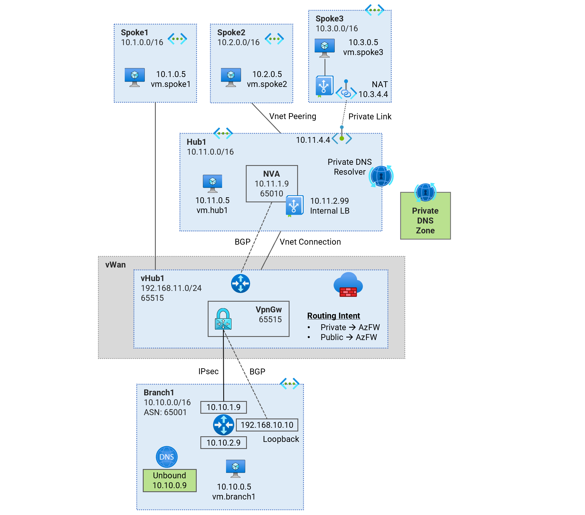

# Virtual WAN <!-- omit from toc -->

Contents
<!-- TOC -->
- [1. Virtual WAN (Single Region)](#1-virtual-wan-single-region)
- [2. Virtual WAN (Dual Region)](#2-virtual-wan-dual-region)
- [3. Secured Virtual WAN (Single Region)](#3-secured-virtual-wan-single-region)
- [4. Secured Virtual WAN (Dual Region)](#4-secured-virtual-wan-dual-region)
<!-- /TOC -->

The terraform codes in this collection cover different hub and spoke network patterns using Virtual WAN.

## [1. Virtual WAN (Single Region)](../2-virtual-wan/1-vwan-single-region/)

This [terraform code](../2-virtual-wan/1-vwan-single-region/) deploys a single-region Virtual WAN (Vwan) testbed to observe traffic routing patterns.

Standard Virtual Network (Vnet) hub (`Hub1`) connects to the Vwan hub (`vHub1`) via a Vwan connection. Direct spoke (`Spoke1`) is connected to the Vwan hub (`vHub1`). `Spoke2`is an indirect spoke from a Vwan perspective; and is connected via standard Vnet peering to `Hub1`. `Spoke2` uses the Network Virtual Applinace (NVA) in the standard Vnet hub (`Hub1`) as the next hop for traffic to all destinations.

The isolated spoke (`Spoke3`) does not have Vnet peering to the Vnet hub (`Hub1`), but is reachable via Private Link Service through a private endpoint in the hub.

`Branch1` is an on-premises network which is simulated using Vnet. Multi-NIC Cisco-CSR-1000V NVA appliances connect to the Vwan hubs using IPsec VPN connections with dynamic (BGP) routing.

## [2. Virtual WAN (Dual Region)](../2-virtual-wan/2-vwan-dual-region/)

This [terraform code](../2-virtual-wan/2-vwan-dual-region/) deploys a multi-hub (multi-region) Virtual WAN (Vwan) testbed to observe traffic routing patterns.

Standard Virtual Network (Vnet) hubs (`Hub1` and `Hub2`) connect to Vwan hubs (`vHub1` and `vHub2` respectively) via a Vwan connections. Direct spokes (`Spoke1` and `Spoke4`) are connected to their respective Vwan hubs via Vnet connections. `Spoke2` and `Spoke5` are indirect spokes from a Vwan perspective; and are connected via standard Vnet peering to `Hub1` and `Hub2` respectively. `Spoke2` and `Spoke5` use the Network Virtual Applinace (NVA) in the standard Vnet hubs as the next hop for traffic to all destinations.

The isolated spokes (`Spoke3` and `Spoke6`) do not have Vnet peering to their respective Vnet hubs (`Hub1` and `Hub2`), but are reachable via Private Link Service through a private endpoint in each respective hub.

`Branch1` and `Branch3` are on-premises networks which are simulated using Vnets. Multi-NIC Cisco-CSR-1000V NVA appliances connect to the Vwan hubs using IPsec VPN connections with dynamic (BGP) routing.

## [3. Secured Virtual WAN (Single Region)](../2-virtual-wan/3-vwan-sec-single-region/)

This [terraform code](../2-virtual-wan/3-vwan-sec-single-region/) deploys a single-region Secured Virtual WAN (Vwan) testbed to observe traffic routing patterns. *Routing Intent* feature is enabled to allow traffic inspection on Azure firewalls for traffic between spokes and branches.

Standard Virtual Network (Vnet) hub (`Hub1`) connects to the Vwan hub (`vHub1`) via a Vwan connection. Direct spoke (`Spoke1`) is connected to the Vwan hub (`vHub1`). `Spoke2`is an indirect spoke from a Vwan perspective; and is connected via standard Vnet peering to `Hub1`. `Spoke2` uses the Network Virtual Applinace (NVA) in the standard Vnet hub (`Hub1`) as the next hop for traffic to all destinations.

The isolated spoke (`Spoke3`) does not have Vnet peering to the Vnet hub (`Hub1`), but is reachable via Private Link Service through a private endpoint in the hub.

`Branch1` is an on-premises network which is simulated using Vnet. Multi-NIC Cisco-CSR-1000V NVA appliances connect to the Vwan hubs using IPsec VPN connections with dynamic (BGP) routing.

## [4. Secured Virtual WAN (Dual Region)](../2-virtual-wan/4-vwan-sec-dual-region/)

This [terraform code](../2-virtual-wan/4-vwan-sec-dual-region/) deploys a multi-hub (multi-region) Secured Virtual WAN (Vwan) testbed to observe traffic routing patterns. *Routing Intent* feature is enabled to allow traffic inspection on Azure firewalls for traffic between spokes and branches.

Standard Virtual Network (Vnet) hubs (`Hub1` and `Hub2`) connect to Vwan hubs (`vHub1` and `vHub2` respectively) via a Vwan connections. Direct spokes (`Spoke1` and `Spoke4`) are connected to their respective Vwan hubs via Vnet connections. `Spoke2` and `Spoke5` are indirect spokes from a Vwan perspective; and are connected via standard Vnet peering to `Hub1` and `Hub2` respectively. `Spoke2` and `Spoke5` use the Network Virtual Applinace (NVA) in the standard Vnet hubs as the next hop for traffic to all destinations.

The isolated spokes (`Spoke3` and `Spoke6`) do not have Vnet peering to their respective hubs (`Hub1` and `Hub2`), but are reachable via Private Link Service through a private endpoint in each respective hub.

`Branch1` and `Branch3` are on-premises networks which are simulated using Vnets. Multi-NIC Cisco-CSR-1000V NVA appliances connect to the Vwan hubs using IPsec VPN connections with dynamic (BGP) routing.

